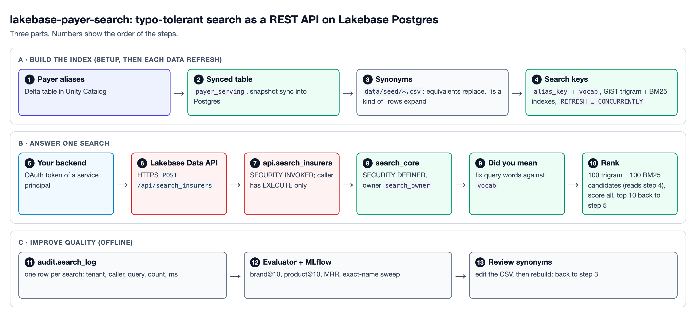

# lakebase-payer-search: typo-tolerant search as a REST API on Lakebase Postgres

A fuzzy name search for US health insurers (payers), served as **one REST endpoint** by the
Lakebase Data API, with **service-principal OAuth** and **no database connection in the client**.
It is the shape an insurance-company dropdown in an EHR needs: type `blu cros georgai` or
`bcbs ga`, get the right payers, 10 per page, best first.

Built on Databricks: Unity Catalog Delta table → Lakebase (Postgres) synced table → one SQL
function → the Lakebase Data API. No app server, no connection pool, no Postgres passwords.
The search itself is plain Postgres: `pg_trgm` for typos, `lakebase_text` BM25 for words and
synonyms. Reuse it for any closed list of names (drugs, providers, suppliers).

> All data is synthetic or public: real public payer brand names, synthetic IDs and plans.
> Proven on Databricks on AWS (us-east-1). The same Lakebase API runs on Azure.

## What a search looks like

```bash
curl -s -X POST "$DATA_API_BASE/api/rpc/search_insurers" \
  -H "Authorization: Bearer $TOKEN" -H 'Content-Type: application/json' \
  -d '{"q":"blu cros georgai","customer_id":"tenant-001","lim":10,"off":0}'
```
```text
rank  payer_id    payer_name                    matched_alias                   state  plan_type
1     SYN001149   Anthem Blue Cross POS - GA    Anthem Blue Cross POS Georgia   GA     commercial
2     SYN000996   Anthem Blue Cross EPO - GA    Anthem Blue Cross EPO Georgia   GA     commercial
3     SYN001047   Anthem Blue Cross HMO - GA    Anthem Blue Cross HMO Georgia   GA     commercial
```
(Real output of the live API, 2026-10-07. Each row also has a `score`. Fields:
[`DATA_CONTRACT.md`](DATA_CONTRACT.md).)

## Pick your path

| I want to… | Read | Then run |
|---|---|---|
| Call the API from my app | [Call it](#call-it), [`client.py`](src/insurer_search/client.py), [`postman/`](postman/) | `uv run pytest -q -m live` |
| Deploy it in my workspace | [Run it in your workspace](#run-it-in-your-workspace), [`docs/deploy.md`](docs/deploy.md) | `databricks bundle deploy` + `scripts/setup.sh` |
| Understand the ranking | [`docs/architecture.md`](docs/architecture.md), [`sql/20_search_function.sql`](sql/20_search_function.sql) | — |
| Add or fix a synonym | [`docs/search-quality.md`](docs/search-quality.md), [`data/seed/synonyms.csv`](data/seed/synonyms.csv) | `SKIP_DATA=1 scripts/setup.sh`, then the evaluator |
| Run it in production | [`docs/operations.md`](docs/operations.md), [`docs/security.md`](docs/security.md) | — |
| Check a claim | [`results/`](results/): every number in these docs links to a file there | — |

## How it works



One search, as a call tree ([`sql/20_search_function.sql`](sql/20_search_function.sql)):
```text
POST /api/rpc/search_insurers            Lakebase Data API: OAuth token -> the caller's Postgres role
  api.search_insurers(q, customer_id, lim, off)    SECURITY INVOKER; the only exposed object
    search_idx.search_core(...)          SECURITY DEFINER, owned by NOLOGIN role search_owner
      check input                        bad input -> SQLSTATE 22023 -> HTTP 400
      did you mean                       fix unknown words against the corpus word list
      near = 100 keys by trigram KNN     typo tolerance (GiST index)
      bm   = 100 keys by BM25            whole words + synonyms
      score every candidate              trigram similarity + BM25 scaled to the best hit
      best alias per payer -> rank -> page (10 per page, 50 max)
      INSERT audit.search_log            tenant, caller, query, count, ms
```
Search reads 33 k normalised keys (`search_idx.alias_key`), not the 3 M alias rows, so cost
follows the number of distinct names. Why each choice: [`docs/adr/`](docs/adr/). Words used:
[`CONTEXT.md`](CONTEXT.md). More: [`docs/architecture.md`](docs/architecture.md).

## What it proves

| | How it is proven |
|---|---|
| **It works** | 3,000,000 alias rows. Live tests call the real API with the real service principal. Built from zero on a new project by [`scripts/ci_proof.sh`](scripts/ci_proof.sh). |
| **Search quality** | Brand in the top 10 for **98.4 %** of 899 queries ([v2 evaluator](results/quality-fn-v2-synfix.json)). Exact-name misses: 0 of 6,291 payers ([exact-name sweep](results/exact-name-deepdive-2026-10-06.md)). |
| **It is secure** | Tests prove: missing / malformed / tampered token refused; a valid token of another identity gets 403; the caller can execute one function and read zero tables; every search is logged with tenant and caller. |
| **It is fast** | Search runs in 9.8 ms inside Postgres (p50, exact-name sweep). See [Performance](#performance). |
| **It can be operated** | One idempotent `scripts/setup.sh`; re-runs refresh the data and the index with no downtime (7,486/7,486 live searches succeeded during a full sync + index refresh: [results](results/zero-downtime-2026-10-06.md)). |

## Call it

```bash
# 1. Token (service principal, OAuth M2M). Lasts 1 hour; refresh before it expires.
TOKEN=$(curl -s -u "$CLIENT_ID:$CLIENT_SECRET" \
  -d 'grant_type=client_credentials&scope=all-apis' \
  "https://<workspace-host>/oidc/v1/token" | jq -r .access_token)

# 2. Search. Page 2 = "off": 10.
curl -s -X POST "$DATA_API_BASE/api/rpc/search_insurers" \
  -H "Authorization: Bearer $TOKEN" -H 'Content-Type: application/json' \
  -d '{"q":"bcbs ga","customer_id":"tenant-001","lim":10,"off":0}'
```

`DATA_API_BASE` is shown in the Lakebase UI (Data API page) and printed by
`scripts/enable_data_api.py`: `https://<endpoint-host>/api/2.0/workspace/<workspace-id>/rest/<database>`.

- Python reference client (token cache, retries, 401 refresh, 5 s timeout): [`src/insurer_search/client.py`](src/insurer_search/client.py)
- Postman collection (token → search → paging → typo → errors → security): [`postman/`](postman/)

## Run it in your workspace

Needs: Lakebase Autoscaling, Unity Catalog, a SQL warehouse, Databricks CLI 1.19+, `psql`,
[`uv`](https://docs.astral.sh/uv/), and a service principal with an OAuth secret.

```bash
cp .env.example .env                                   # fill it in
databricks bundle deploy -p <profile>                  # Lakebase project + 2-16 CU compute
scripts/setup.sh                                       # everything else, in order:
#   0 turn on Lakebase Search   1-2 data -> Delta   3 sync to Postgres   4 index
#   5 search function   6 Data API (schema api only)   7 caller grants
uv run pytest -q                                       # offline tests + live API suite
```
Step 0 is the same call as the UI button "Enable Lakebase Search". It restarts the compute once
and cannot be undone. Details, teardown and the from-zero proof: [`docs/deploy.md`](docs/deploy.md).

Re-run `scripts/setup.sh` at any time (`SKIP_DATA=1` to skip regenerating data).

## Search quality (v2)

`uv run python -m insurer_search.evaluate --sample 150` generates 899 queries and scores them
against the live API ([v2 results](results/quality-fn-v2-synfix.json)). Synonyms are generated
(`python -m insurer_search.synonyms`: initials, `bcbs`+state, joined words, with collision rules)
plus a hand-checked list (`data/seed/synonyms.csv`). Method:
[`docs/research/synonym-method.md`](docs/research/synonym-method.md).

| Query kind | Queries | brand@10 |
|---|---:|---:|
| exact name | 150 | 99.3 % |
| one typo | 150 | 98.0 % |
| brand with typo | 150 | 99.3 % |
| initials | 90 | 98.9 % |
| words joined | 119 | 100 % |
| a word dropped | 90 | 91.1 % |
| state first | 150 | 100 % |
| **all 899** | — | **98.4 %** |

The one rule to know before you edit synonyms ([`sql/10_search_index.sql`](sql/10_search_index.sql), step 1b):
```text
for each synonym row (word -> canonical):
  if kind in (program_name, brand_family, former_name) and word is still a brand in payer names:
    EXPAND   keep the brand, add the wider word      badgercare product also matches "medicaid wi"
  else:
    REPLACE  the word becomes the canonical lexeme   bcbs = blue cross blue shield
```
A tokenizer synonym replaces the word, like a Postgres synonym dictionary. Using it for "is a
kind of" would erase the brand. Wider-word queries: 80 of 88 hit
([results](results/wider-word-2026-10-07.md)). More: [`docs/search-quality.md`](docs/search-quality.md).

## Performance

**v2 (shipped)**, 2–16 CU on AWS, 3 M rows, 4 in-region load tasks, no think time:

| Users | Requests/s | p50 ms | p95 ms | p99 ms | Failures |
|---:|---:|---:|---:|---:|---:|
| 10 | 262.3 | 27 | 58 | 76 | 0 |
| 25 | 331.4 | 64 | 140 | 190 | 0 |
| 100 | 326.5 | 290 | 460 | 580 | 0 |
| 400 | 323.4 | 1,300 | 1,500 | 1,600 | 0 |

**About 315–331 requests/s** with v2, against about 200–245 with v1 at the same CU range
([results](results/exact-name-deepdive-2026-10-06.md)).

- **At 16–32 CU: about 440–465 requests/s, 0 failures up to 800 users** (original function, v1):
  [results](results/loadtest-cu32-2026-10-06.md). 32 CU is the single-endpoint maximum.
- **Cold start:** the first call after scale-to-zero returns 200 in about 1.6 s (4 of 4 trials), not an
  error: [results](results/coldstart-2026-10-06.md). Use a 5 s client timeout; keep the compute on for production.
- **CU sizing:** minimum 2 CU. 1 CU returned HTTP 500 "out of memory" at 200+ users
  ([results](results/loadtest-cu32-2026-10-06.md)).
- Re-run it: `uv run python scripts/run_loadtest.py --tasks 4 --steps 10,25,50,100,200,400`.

## Security model

- The client holds a **service-principal OAuth secret**, never a database password or connection string.
- The Data API exposes **only schema `api`**. CORS is off. Max 50 rows per response.
- The caller's Postgres role (made with `databricks_create_role`, granted to `authenticator`) has
  **EXECUTE on the search function and nothing else**. All reads and the log write happen inside a
  `SECURITY DEFINER` function owned by a `NOLOGIN` role ([ADR 0004](docs/adr/0004-definer-function-is-the-only-door.md)).
- Input is validated in SQL and passed as parameters; SQL text in `q` is just text (tested).
- `audit.search_log`: tenant, query, page, result count, duration and caller, one row per search.

More: [`docs/security.md`](docs/security.md).

## Security and compliance

| Question | Answer |
|---|---|
| Is the Data API GA? | Yes, on AWS and Azure (Azure regions include `eastus` and `eastus2`). |
| HIPAA? | Lakebase is supported in workspaces with the HIPAA compliance security profile. The Data API is the REST interface to that same database. ([AWS](https://docs.databricks.com/aws/en/oltp/projects/hipaa-compliance), [Azure](https://learn.microsoft.com/en-us/azure/databricks/oltp/projects/hipaa-compliance)) |
| What is audited? | Two layers. (1) In a HIPAA workspace, Lakebase sends Postgres SQL audit events (`pgaudit`, parameters not logged) to `system.access.audit` with `service_name = 'lakebase'` ([docs](https://learn.microsoft.com/en-us/azure/databricks/oltp/projects/hipaa-audit-logging)). This is SQL-level, not one row per HTTP request. (2) This repo adds one row per search in `audit.search_log`: tenant, calling identity, query, time. That is the per-request trail. |
| Is there PHI in it? | No. Searches carry insurer names, not patient data, so no PHI reaches SQL text or either log. |
| Private Link? | The Data API is HTTPS on 443. A Data API-only app uses the standard inbound Private Link endpoint; the separate Postgres (5432) endpoint is not needed ([docs](https://learn.microsoft.com/en-us/azure/databricks/oltp/projects/private-link)). |
| Turning HIPAA on later? | A Lakebase project that was running when HIPAA was enabled must restart its compute once before audit logging applies. |

Before go-live in a HIPAA workspace: run one test search and confirm `service_name = 'lakebase'`
rows appear in `system.access.audit`. (Not tested here: the test workspace has no HIPAA profile.)

## Known limits

- **Throughput**: see Performance. The Data API's own rate limits are not documented; load test at your peak.
- **Each search writes a log row**, so it runs on the read-write compute, not a read replica.
- **`customer_id` is trusted** as sent by the calling gateway. Fine for a shared payer list; per-tenant lists need more.
- **Azure + Private Link** not run here (tested on AWS). The Data API host is regional
  (`*.database.<region>.azuredatabricks.net`, HTTPS 443); a private-only setup needs a DNS entry for it.
- The `authenticator` role has an 8 s statement timeout; searches take milliseconds.

## Repo map

```text
lakebase-payer-search/
├── databricks.yml        # bundle: Lakebase project + compute            (start here to deploy)
├── scripts/setup.sh      # steps 0-7, idempotent; ci_proof.sh = build from zero, test, delete
├── sql/
│   ├── 10_search_index.sql     # synonyms, search keys, GiST + BM25, vocab, search log
│   ├── 20_search_function.sql  # api.search_insurers -> search_core   (start here for ranking)
│   ├── 40_caller_grants.sql    # caller: EXECUTE on one function, nothing else
│   └── proposed/               # experiments and the exact-name sweep
├── src/insurer_search/   # client, evaluator, data + synonym generators, wider-word check
├── data/seed/            # payer brands, abbreviations, synonyms     (start here for synonyms)
├── tests/                # offline + live API suite (-m live)
├── jobs/quality_flywheel/# evaluator + MLflow job
├── loadtest/             # Locust file + in-region runner
├── postman/              # Postman collection
├── results/              # the evidence behind every number
└── docs/                 # deploy, architecture, search quality, operations, security, faq, adr/
```

## Related

- `lakebase_search_reference`: the general Lakebase Search reference (vector + text). This repo
  is one focused use of it: a closed list of names, typo-tolerant, behind one REST call.

## License

[Apache-2.0](LICENSE).
